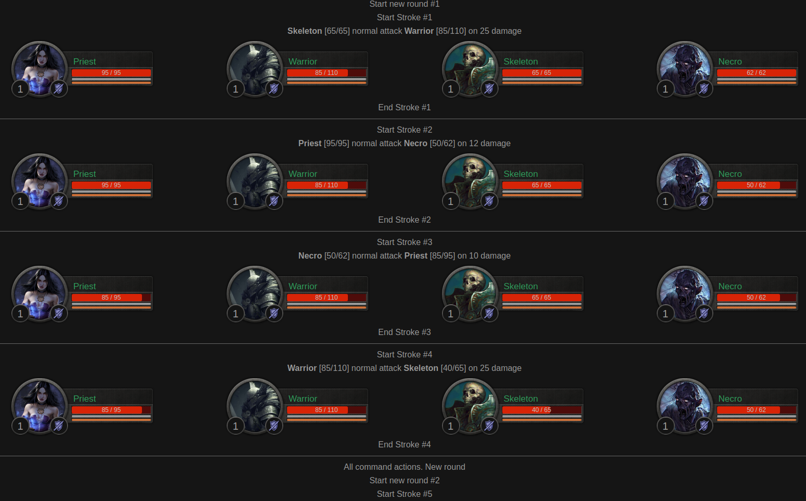

<h1>Модуль командного боя</h1>

На красивом ООП + unit-тесты

Запуск боя: 
public/index.php

Запуск тестов: 
php vendor/bin/phpunit

## Как выглядит бой

## Планы

- Добавить уровень юнитов
- Добавить проверки на min/max значения в параметрах юнита
- Добавить расу юнитов (Раса как класс, которая возвращает id расы, название расы, иконку расы, цвет имени расы)
- Добавить особые способности рас: орки двойной урон на низком уровне здоровья, эльфы - способность уклониться от атак
люди - шанс избежать смерти и восстановить 50% здоровья
- Добавить проверку на дубли ID в UnitStatisticCollection
- Переделать работу Chat - сейчас он хранит не чат, а весь html код боя
- [Ошибка] Для лечения в Command выбираются мертвые юниты. Должны выбираться только живые
- Доработать логику выбора юнита для лечения - должен выбираться самый раненый юнит. Сейчас выбирается случайный
- Переделать отображение боя: стартовый вид юнитов, чат, детальный лог боя
- Реализовать анимацию боя на JS и генерацию скрипта для анимации
- В View вынести пути к шаблонам в конструктор и задавать по умолчанию в Фабрике
- Добавить мультиязычность
- Добавить больше разнообразных способностей
- Реализовать механику эффектов
- Расширить варианты классов, добавив новым классам новые варианты способностей
- Переделать простой int урон на объект Damage с расширенными параметрами, такие как шанс крита, сила крита, стихии 
урона и т.д.
- Реализовать расширенный вариант защитных параметров Defence - с такими параметрами как шанс блока, уклонение, 
сопротивления различным стихиям
- htmlspecialchars имен юнитов (потому что это могут быть и имена игроков, а имена игроков могут иметь спецсимволы)
- Сделать сайт-пример с боем
- Сделать все аватары повернутыми вправо, а у правой команды через css разворачивать их по горизонтали, таким образом
все юниты будут смотреть друг на друга
- И многое другое
