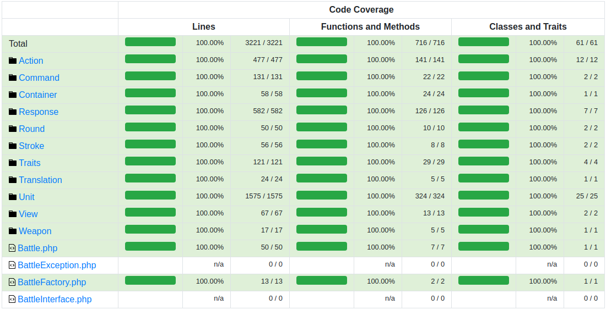

# Battle Module

Модуль командного, пошагового боя для браузерной игры. Так как вся игра пошаговая, и придерживается принципа 
ненапряженного геймплея, который можно в любой момент прекратить, а потом, когда будет удобно – продолжить, бои 
проходят в автоматическом режиме, а игроку лишь воспроизводится результат. Т.е. прямого управления над боем нет.

Текущий проект является переписыванием с нуля старой версии боевой системы, написанной в 2017 году, посмотреть которую
в работе можно на [сайте игры](https://dwdemo2.ru/registration/github).

## Пример (1 на 1)

```php
use Battle\BattleFactory;

$data = [
    [
        'id'                           => '81941b8a-f7ca-447e-8951-36777ae6e79e',
        'name'                         => 'Warrior',
        'level'                        => 3,
        'avatar'                       => '/images/avas/humans/human001.jpg',
        'life'                         => 110,
        'total_life'                   => 110,
        'mana'                         => 60,
        'total_mana'                   => 60,
        'melee'                        => true,
        'class'                        => 1,
        'race'                         => 1,
        'command'                      => 1,
        'add_concentration_multiplier' => 0,
        'add_rage_multiplier'          => 0,
        'offense'      => [
            'damage_type'         => 1,
            'weapon_type'         => 2,
            'physical_damage'     => 25,
            'fire_damage'         => 0,
            'water_damage'        => 0,
            'air_damage'          => 0,
            'earth_damage'        => 0,
            'life_damage'         => 0,
            'death_damage'        => 0,
            'attack_speed'        => 0.8,
            'cast_speed'          => 0,
            'accuracy'            => 200,
            'magic_accuracy'      => 100,
            'block_ignoring'      => 0,
            'critical_chance'     => 10,
            'critical_multiplier' => 200,
            'vampire'             => 0,
        ],
        'defense'      => [
            'physical_resist'     => 20,
            'fire_resist'         => 10,
            'water_resist'        => 0,
            'air_resist'          => 0,
            'earth_resist'        => 0,
            'life_resist'         => 20,
            'death_resist'        => 0,
            'defense'             => 120,
            'magic_defense'       => 80,
            'block'               => 0,
            'magic_block'         => 0,
            'mental_barrier'      => 0,
            'max_physical_resist' => 75,
            'max_fire_resist'     => 75,
            'max_water_resist'    => 75,
            'max_air_resist'      => 75,
            'max_earth_resist'    => 75,
            'max_life_resist'     => 75,
            'max_death_resist'    => 75,
            'global_resist'       => 0,
        ],
    ],
    [
        'id'                           => 'bf75c4a3-b866-4787-88c7-8db57daf3d64',
        'name'                         => 'Skeleton',
        'level'                        => 2,
        'avatar'                       => '/images/avas/monsters/005.png',
        'life'                         => 65,
        'total_life'                   => 65,
        'mana'                         => 0,
        'total_mana'                   => 0,
        'melee'                        => true,
        'class'                        => null,
        'race'                         => 8,
        'command'                      => 2,
        'add_concentration_multiplier' => 0,
        'add_rage_multiplier'          => 0,
        'offense'      => [
            'damage_type'         => 1,
            'weapon_type'         => 1,
            'physical_damage'     => 0,
            'fire_damage'         => 0,
            'water_damage'        => 0,
            'air_damage'          => 0,
            'earth_damage'        => 0,
            'life_damage'         => 0,
            'death_damage'        => 20,
            'attack_speed'        => 1.2,
            'cast_speed'          => 0,
            'accuracy'            => 240,
            'magic_accuracy'      => 140,
            'block_ignoring'      => 0,
            'critical_chance'     => 6,
            'critical_multiplier' => 200,
            'vampire'             => 0,
        ],
        'defense'      => [
            'physical_resist'     => 10,
            'fire_resist'         => 30,
            'water_resist'        => 30,
            'air_resist'          => 0,
            'earth_resist'        => 0,
            'life_resist'         => 0,
            'death_resist'        => 70,
            'defense'             => 150,
            'magic_defense'       => 30,
            'block'               => 0,
            'magic_block'         => 0,
            'mental_barrier'      => 0,
            'max_physical_resist' => 75,
            'max_fire_resist'     => 75,
            'max_water_resist'    => 75,
            'max_air_resist'      => 75,
            'max_earth_resist'    => 75,
            'max_life_resist'     => 75,
            'max_death_resist'    => 75,
            'global_resist'       => 0,
        ],
    ],
];

$battle = BattleFactory::create($data);
$result = $battle->handle();

$view = $battle->getContainer()->getViewFactory()->create();
echo $view->renderHead(); // example layout styles
echo $view->renderResult($result);
```

## Как выглядит бой (4 игрока против босса)


### Итоговая статистика

Alchemist во время боя призвал Fire Elemental в свою команду – по этому в статистике появился дополнительный юнит


Вы можете запустить и посмотреть пример боя открыв страницу:

`public/index.php`


## 100% покрытие кода unit-тестами



## GitLab CI


## Архитектурные принципы

Модуль написан на принципах DDD:

- Имеет свой, независимый неймспейс `Battle`
- Написан полностью независимым от фреймворков, и прочих тяжелых зависимостей
- Изолированно выполняет свою задачу: принимает данные по сражающимся юнитам (это может быть как бой 1 на 1 так и
  команда на команду), обрабатывает бой и возвращает результат, на основании которого можно отобразить бой на фронте
- Классы в модуле полностью соответствуют «бизнес»-сущностям, а именно:
    - Бой обрабатывается в классе `Battle`
    - Сражающиеся две команды реализованы в классах `Command`
    - Команды состоят из юнитов (это могут быть как персонажи игроков, так и монстры), реализованных в классе `Unit`
    - Процесс боя проходит в раундах – классе `Round` в котором каждый живой юнит должен совершить свой ход. После того,
    как все юниты походили, начинается новый раунд
    - Раунд состоит из ходов одного юнита, и эти ходы реализованы в классах `Stroke`
    - Взаимодействие между юнитами построено на обмене абстрактных `Action` – это может быть как удар, так и лечение, 
    так и использование способности. При этом для внешних объектов совершенно не важно, что это – просто у одного юнита
    запрашивается коллекция его действий, и выполняется. При этом само действие определяет, на кого оно должно 
    примениться.
    - Результат боя сохраняется в `Result`
    - Статистика по бою сохраняется в `Statistic`
    - Класс отвечающий за мультиязычность – `Translation`
- Все важные зависимости завязаны на интерфейсы, а не на конкретные классы
- Большое внимание уделено тестам и проработке исключительных ситуаций. Покрытие кода тестами 100%

## Планы

- Добавить механику отключения базовой атаки у юнита (возможно, просто через 0 скорость атаки). Это позволит делать, 
например, юниты-стены, которые просто находятся в первом ряду и защищают юнитов с дальней атакой. Или, например, паучье 
гнездо – юнит, который не атакует, а только призывает новых пауков в свою команду.
- Реализовать механику применения эффекта на всю команду (на всю вражескую команду реализовано, осталось сделать на всю
свою команду)
- Подумать над реализацией эффектов, которые могут активироваться/деактивироваться при определенном параметре юнита
- EffectAction добавить параметр buff: true/false указывающий на то, является ли это положительный или отрицательный 
эффект
- Добавить CancelBuffAction и CancelDebuffAction – отменяющие все положительные или все отрицательные эффекты
- Добавить возможность добавления способностей не только от класса, но и на прямую при создании юнита. Это позволит
создавать предметы, которые дают определенные боевые способности
- Добавить способностям параметр актуальности, чтобы в случае одновременной активации двух способностей – использовалась
наиболее актуальная
- Добавить особые способности рас: (+) орки двойной урон на низком уровне здоровья, эльфы – способность уклониться от 
атак, (+) люди – шанс избежать смерти и восстановить 50% здоровья
- Добавить больше разнообразных способностей
- Расширить варианты классов, добавив новым классам новые варианты способностей
- Сделать сайт-пример с боем
- Сделать все аватары повернутыми вправо, а у правой команды через css разворачивать их по горизонтали, таким образом
все юниты будут смотреть друг на друга
- Добавить механику увеличения урона, в слишком долгих боях
- Добавить развертывание через Docker
- Перевести все комментарии в коде на английский
- Фиксированное количество сражающихся команд увеличить на любое, больше 2-х – это позволит делать не только бой 1 на 1
  или команда на команду, а например бои с 5 участниками в формате каждый сам за себя
- Доработать механику attack_speed/cast_speed в способностях, сейчас этот параметр никак не задействован - способность
атакующие способности применяются один раз
- И многое другое

## Реализованные характеристики

План по реализации характеристик юнитов. По этому списку можно оценить навороченность запланированной боевой механики.

- [x] `id` – id юнита
- [x] `side` – Сторона (правая или левая) за которую сражается юнит
- [x] `row` – 1 или 2 ряд в бою. Юниты ближнего боя располагаются в 1 ряду, юниты дальнего боя - во 2 ряду
- [x] `already action` – Этот параметр указывает, ходил ли юнит в текущем раунде
- [x] `avatar` – Путь к аватару юнита
- [x] `name` – Имя юнита
- [x] `level` – Уровень юнита
- [x] `life` – Текущий и максимальный запас здоровья юнита
- [x] `mana` – Текущий и максимальный запас маны юнита.
- [x] `mental barrier` – Если юнит имеет ментальный барьер, то урон вначале будет идти по мане, и только потом по здоровью
- [x] `physical damage` – Физический урон
- [x] `fire damage` – Урон стихией огня
- [x] `water damage` – Урон стихией вод
- [x] `air damage` – Урон стихией воздуха
- [x] `earth damage` – Урон стихией земли
- [x] `life damage` – Урон магией жизни
- [x] `death damage` – Урон магией смерти
- [x] `physical resist` – Сопротивление физическому урону
- [x] `fire resist` – Сопротивление урону огнем
- [x] `water resist` – Сопротивление урону водой
- [x] `air resist` – Сопротивление урону воздухом
- [x] `earth resist` – Сопротивление урону землей
- [x] `life resist` – Сопротивление урону магией жизни
- [x] `death resist` – Сопротивление урону магией смерти
- [x] `physical max resist` – Максимальное сопротивление физическому урону
- [x] `fire max resist` – Максимальное сопротивление урону огнем
- [x] `water max resist` – Максимальное сопротивление урону водой
- [x] `air max resist` – Максимальное сопротивление урону воздухом
- [x] `earth max resist` – Максимальное сопротивление урону землей
- [x] `life max resist` – Максимальное сопротивление урону магией жизни
- [x] `death max resist` – Максимальное сопротивление урону магией смерти
- [x] `accuracy` – Меткость, влияет на шанс попадания по противнику атаками
- [x] `magic accuracy` – Магическая меткость, влияет на шанс попадания по противнику заклинаниями
- [x] `defense` – Защита, влияет на шанс уклониться от удара противника
- [x] `magic defense` – Магическая защита, влияет на шанс уклониться от заклинания противника
- [x] `critical chance` – Шанс критического удара
- [x] `critical multiplier` – Сила критического удара
- [ ] `damage multiplier` – Общий множитель наносимого урона
- [x] `damage type` – Тип удара: атака или заклинание
- [x] `weapon type` – Тип используемого оружия. Некоторые типы оружия могут при ударе наложить на цель дополнительный 
эффект, например: кинжалы могут вызвать кровотечение, а дробящее оружие оглушить врага
- [x] `attack speed` – Скорость атаки. Рассчитывается следующим образом: attack speed 1.3 означает, что юнит 100% нанесет 
один удар в своем ходе, и с 30% вероятностью еще один удар в этом же ходу. А attack speed 0.7 означает, что юнит с 70%
вероятностью нанесет урон, а с 30% вероятностью ничего не сделает, а в чате отобразится сообщение «юнит готовится к 
атаке»
- [x] `cast speed` – Скорость создания заклинаний. Механика аналогична скорости атаки, только относится к типу удара 
заклинание
- [x] `block` – Шанс заблокировать атаку противника
- [x] `magic block` – Шанс заблокировать заклинание противника
- [x] `block ignoring` – Игнорирование блока. Некоторые типы оружия настолько тяжелые, что могут полностью игнорировать блок
- [ ] `dodge` – Уклонение. Вероятность избежать удара или заклинания противника. Не зависит от меткости противника
- [x] `concentration` – Концентрация. Постепенно накапливается в бою и при полном заполнении позволяет использовать 
способности требующую концентрацию
- [ ] `cunning` – Хитрость. С некоторой вероятностью позволяет активировать способности относящихся к типу хитрости. 
Базовое значение: 15
- [x] `rage` – Ярость. Постепенно накапливается в бою и при полном заполнении позволяет использовать способности требующие 
ярость
- [x] `add concentration multiplier` – Отвечает за множитель получаемой концентрации
- [ ] `add cunning multiplier` – Отвечает за множитель хитрости
- [x] `add rage multiplier` – Отвечает за множитель получаемой ярости
- [x] `race name` – Название расы юнита
- [x] `race color` – Цвет расы юнита. Используется для цветового выделения имени юнита
- [x] `race ability` – Способности расы
- [x] `class name` – Название класса юнита
- [x] `class abilities` – Способности класса
- [x] `global resist` – Общий множитель получаемого урона
- [x] `vampire` – Позволяет воровать часть нанесенного урона в здоровье
- [ ] `magic vampire` – Позволяет воровать часть нанесенного урона в ману

Всего 59 характеристик. Вместе с гибкой [системой эффектов](https://github.com/WalkWeb/Battle-Module/tree/master/src/Battle/Unit/Effect) 
это позволит создавать практически неограниченное количество игровых механик.
