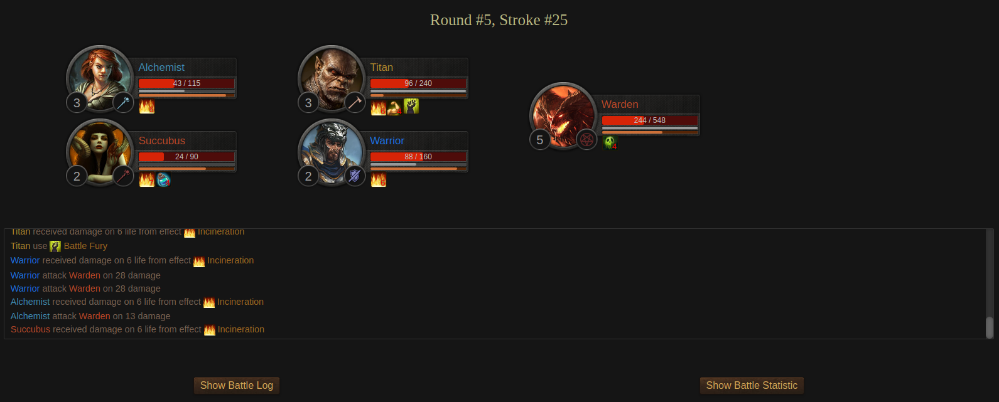
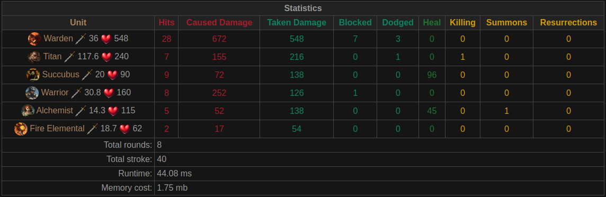

# Battle Module

Модуль командного, пошагового боя для браузерной игры.

## Пример (1 на 1)

```php
use Battle\BattleFactory;
use Battle\View\ViewFactory;

$data = [
    [
        'id'           => '81941b8a-f7ca-447e-8951-36777ae6e79e',
        'name'         => 'Warrior',
        'level'        => 3,
        'avatar'       => '/images/avas/humans/human001.jpg',
        'damage'       => 25,
        'attack_speed' => 0.8,
        'life'         => 110,
        'total_life'   => 110,
        'melee'        => true,
        'class'        => 1,
        'race'         => 1,
        'command'      => 1,
    ],
    [
        'id'           => 'bf75c4a3-b866-4787-88c7-8db57daf3d64',
        'name'         => 'Skeleton',
        'level'        => 2,
        'avatar'       => '/images/avas/monsters/005.png',
        'damage'       => 20,
        'attack_speed' => 1.2,
        'life'         => 65,
        'total_life'   => 65,
        'melee'        => true,
        'class'        => null,
        'race'         => 8,
        'command'      => 2,
    ],
];
$battle = BattleFactory::create($data);
$result = $battle->handle();

$view = (new ViewFactory())->create($battle->getTranslation());
echo $view->renderHead(); // example layout styles
echo $view->renderResult($result);
```

## Как выглядит бой (2 на 3)



### Итоговая статистика




Вы можете запустить и посмотреть бой открыв страницу:

`public/index.php`


## 100% покрытие кода unit-тестами


## GitLab CI


## Архитектурные принципы

Модуль написан на принципах DDD:

- Имеет свой, независимый неймспейс `Battle`
- Написан полностью независимым от фреймворков, и прочих тяжелых зависимостей
- Изолированно выполняет свою задачу: принимает данные по сражающимся юнитам (это может быть как бой 1 на 1 так и
  команда на команду), обрабатывает бой и возвращает результат, на основании которого можно отобразить бой на фронте
- Классы в модуле полностью соответствуют «бизнес»-сущностям, а именно:
    - Бой обрабатывается в классе `Battle`
    - Сражающиеся две команды реализованы в классах `Command`
    - Команды состоят из юнитов (это могут быть как персонажи игроков, так и монстры), реализованных в классе `Unit`
    - Процесс боя проходит в раундах - классе `Round` в котором каждый живой юнит должен совершить свой ход. После того,
    как все юниты походили, начинается новый раунд
    - Раунд состоит из ходов одного юнита, и эти ходы реализованы в классах `Stroke`
    - Взаимодействие между юнитами построено на обмене абстрактных `Action` - это может быть как удар, так и лечение, 
    так и использование способности. При этом для внешних объектов совершенно не важно, что это - просто у одного юнита
    запрашивается коллекция его действий, и выполняется. При этом само действие определяет, на кого оно должно 
    примениться.
    - Результат боя сохраняется в `Result`
    - Статистика по бою сохраняется в `Statistic`
- Все важные зависимости завязаны на интерфейсы, а не на конкретную реализацию
- Большое внимание уделено тестам и проработке всех пограничных ситуаций. Покрытие кода тестами 100%

## Планы

- Добавить конвертацию характеристик юнита в array и json
- Добавить анимацию призыва
- Реализовать создание способности через массив параметров
- Подумать над реализацией ручного режима боя
- Задавать параметр action, concentration and rage у юнита через конструктор
- Добавить способностям иконки
- В статистику добавить подсчет присумоненых существ
- Добавить особые способности рас: орки двойной урон на низком уровне здоровья, эльфы - способность уклониться от атак
люди - шанс избежать смерти и восстановить 50% здоровья
- Переделать отображение боя: стартовый вид юнитов, чат, детальный лог боя
- Добавить больше разнообразных способностей
- Реализовать механику эффектов
- Расширить варианты классов, добавив новым классам новые варианты способностей
- Переделать простой int урон на объект Damage с расширенными параметрами, такие как шанс крита, сила крита, стихии 
урона и т.д.
- Реализовать расширенный вариант защитных параметров Defence - с такими параметрами как шанс блока, уклонение, 
сопротивления различным стихиям
- Сделать сайт-пример с боем
- Добавить ману
- Добавить параметр магического щита - когда часть урона идет по мане, перед здоровьем
- Сделать все аватары повернутыми вправо, а у правой команды через css разворачивать их по горизонтали, таким образом
все юниты будут смотреть друг на друга
- Добавить механику выбора победителя, когда остались живы обе команды - по количеству здоровья у выживших
- Добавить механику увеличения урона, в слишком долгих боях
- Docker
- Добавить параметр отвечающий за того, какой юнит ходит (или случайный)
- К параметру юнита, который ходит, добавить возможную цель для атаки и используемая способность
- Добавить конвертацию любой стадии боя в массив
- Перевести все комментарии в коде на английский
- Фиксированное количество сражающихся команд увеличить на любое, больше 2-х - это позволит делать не только бой 1 на 1
  или команда на команду, а например бои с 5 участниками в формате каждый сам за себя
- И многое другое
